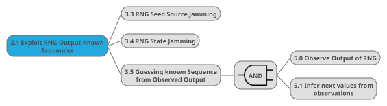

# Attack Description: Node Compromise (P)RNG Somehow

RNG Somehow.png)

## Attack Classification

## Attack Threat

## Suggested Mitigation

## Attack Description: Node 1.0 Software RNG

### Attack Classification

### Attack Threat

### Suggested Mitigation

## Attack Description: Node 1.1 Hardware RNG

### Attack Classification

### Attack Threat

### Suggested Mitigation

## Attack Description: Node 2.2 Replace Output With Constant Value ('Pinning')

### Attack Classification

### Attack Threat

### Suggested Mitigation

## Attack Description: Node 2.3 Exploit RNG Output Known Sequences

### Attack Classification

### Attack Threat

### Suggested Mitigation

## Attack Description: Node 1.2 SW/HW Hybrid

### Attack Classification

### Attack Threat

### Suggested Mitigation

# Attack Description: Node 2.0 Replace Output With Constant Value ('Pinning')

.png)

## Attack Classification

## Attack Threat

## Suggested Mitigation

## Attack Description: Node 3.0 Tamper RNG Executable Code

### Attack Classification

### Attack Threat

### Suggested Mitigation

## Attack Description: Node 3.1 Tamper With Client-of-RNG Code

### Attack Classification

### Attack Threat

### Suggested Mitigation

## Attack Description: Node 3.2 (Generally) Tamper With RNG Data

### Attack Classification

### Attack Threat

### Suggested Mitigation

## Attack Description: Node 4.0 Continuous RNG State Reset

### Attack Classification

### Attack Threat

### Suggested Mitigation

## Attack Description: Node 4.1 (other, implementation and integration specific)

### Attack Classification

### Attack Threat

### Suggested Mitigation

# Attack Description: Node 2.1 Exploit RNG Output Known Sequences

## Attack Classification

## Attack Threat

## Suggested Mitigation

## Attack Description: Node 3.3 RNG Seed Source Jamming

### Attack Classification

### Attack Threat

### Suggested Mitigation

## Attack Description: Node 3.4 RNG State Jamming

### Attack Classification

### Attack Threat

### Suggested Mitigation

## Attack Description: Node 3.5 Guessing Known Sequence From Observed Output

### Attack Classification

### Attack Threat

### Suggested Mitigation

## Attack Description: Node 5.0 Observe Output of RNG

### Attack Classification

### Attack Threat

### Suggested Mitigation

## Attack Description: Node 5.1 Infer Next Values From Observations

### Attack Classification

### Attack Threat

### Suggested Mitigation
